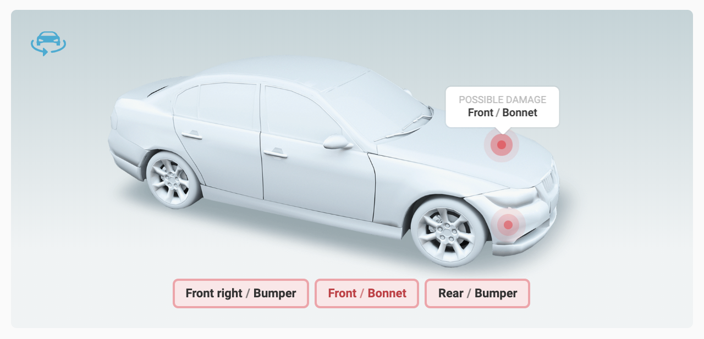
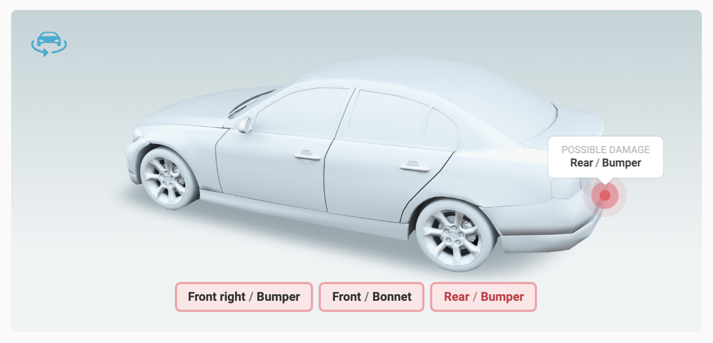

# Homework for Frontend Candidate

Build a React component that displays damage points on a vehicle body. To demo it, create a small app that fetches damage points from an API and passes them into the component for rendering.

## Design

### Front

### Rear

## Requirements

- [ ] Damage points are fetched from http://www.mocky.io/v2/5e1f0a50310000360018969a
- [ ] Component supports both front and rear damage points. _Please note that rear points should only be shown in rear view_
- [ ] User can select damage point and it’s highlighted
- [ ] When user selects a point, it’s not only highlighted, but also a tooltip appears above it
- [ ] Component uses [React Hooks](https://reactjs.org/docs/hooks-reference.html)
- [ ] Share code as a private repo on GitHub. Add [@Cinamonas](https://github.com/Cinamonas/) as a collaborator for review
- [ ] `README` should include instructions on how to run the app for testing

## Notes

- You can bootstrap the app however you want
- If you’re unsure on how some interaction should work, just use your best judgement
- You only have to add support for the points that are returned from the API
- All the assets you might need can be found in `assets` dir of this repo
